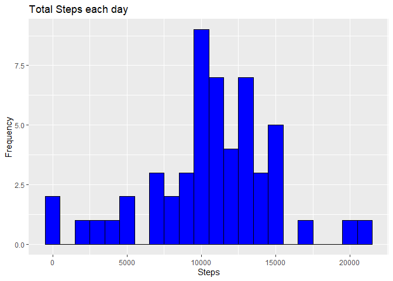

## Github Repositories :

                https://github.com/rupenders/Reproducible_research_Cousera_ASS1
               

## Inroduction :

This assignment makes use of data from a personal activity monitoring device. This device collects data at 5 minute intervals through out the day. The data consists of two months of data from an anonymous individual collected during the months of October and November, 2012 and include the number of steps taken in 5 minute intervals each day.

The variables included in this data set are:

* Steps : Number of steps taking in a 5-minute interval (missing values are coded as NA).<br/>
* date : The date on which the measurement was taken in YYYY-MM-DD format.<br/>
* interval: Identifier for the 5-minute interval in which measurement was taken.<br/>

## Commit containing full submission

1.Code for reading in the dataset and/or processing the data<br/>
2.Histogram of the total number of steps taken each day<br/>
3.Mean and median number of steps taken each day<br/>
4.Time series plot of the average number of steps taken<br/>
5.The 5-minute interval that, on average, contains the maximum number of steps<br/>
6.Code to describe and show a strategy for imputing missing data<br/>
7.Histogram of the total number of steps taken each day after missing values are            imputed<br/>
8.Panel plot comparing the average number of steps taken per 5-minute interval across       weekdays and weekends<br/>
9.All of the R code needed to reproduce the results (numbers, plots, etc.) in the           report<br/>


## Link to the Data Set

                https://d396qusza40orc.cloudfront.net/repdata%2Fdata%2Factivity.zip
            

#  Load Libaray

```r
library(data.table)
library(dplyr)
library(ggplot2)
library(xtable)
```

# 1. Download, unzip and load the data

```r
dir_d <- getwd()
url <- "https://d396qusza40orc.cloudfront.net/repdata%2Fdata%2Factivity.zip"
download.file(url, file.path(dir_d, "dataFiles.zip"))
unzip(zipfile = "dataFiles.zip")
acti_data <- data.table::fread("activity.csv")
head(acti_data)
```

```
##    steps       date interval
## 1:    NA 2012-10-01        0
## 2:    NA 2012-10-01        5
## 3:    NA 2012-10-01       10
## 4:    NA 2012-10-01       15
## 5:    NA 2012-10-01       20
## 6:    NA 2012-10-01       25
```


# 2. Total number of steps taken each date

```r
data_sub <-acti_data %>% select(steps,date) %>% filter(steps != "NA") %>% 
        group_by(date) %>% summarize(Total_steps = sum(steps))

ggplot(data_sub, aes(x = Total_steps)) +
    geom_histogram(color ="black", fill = "blue", binwidth = 1000) +
    labs(title = "Total Steps each day", x = "Steps", y = "Frequency")
```

<!-- -->

# 3. Mean and Median of steps taken each date

```r
data_sub <-acti_data %>% select(steps,date) %>% filter(steps != "NA") %>% 
        group_by(date) %>% summarize(Means = mean(steps),Medians =median(steps))
ta <- head(data_sub,10)
print(ta, type = "html")
```

```
## # A tibble: 10 x 3
##    date        Means Medians
##    <date>      <dbl>   <dbl>
##  1 2012-10-02  0.438       0
##  2 2012-10-03 39.4         0
##  3 2012-10-04 42.1         0
##  4 2012-10-05 46.2         0
##  5 2012-10-06 53.5         0
##  6 2012-10-07 38.2         0
##  7 2012-10-09 44.5         0
##  8 2012-10-10 34.4         0
##  9 2012-10-11 35.8         0
## 10 2012-10-12 60.4         0
```


# 4. Time series plot of the average number of steps taken

```r
data_sub <-acti_data %>% select(steps,date,interval) %>% filter(steps != "NA") %>% 
        group_by(interval) %>% summarize(Means = mean(steps))
ggplot(data_sub, aes(x = interval , y = Means)) + geom_line(color="blue", size=1) + labs(title = "Avg. Daily Steps", x = "Interval", y = "Avg. Steps per day")
```

<!-- -->

# 5. Which 5-minute interval, on average across all the days in the dataset, contains the maximum number of steps?

```r
data_sub <-acti_data %>% select(steps,date,interval) %>% filter(steps != "NA") %>% group_by(interval) %>% summarize(Max_Steps = max(steps)) %>% filter(Max_Steps== max(Max_Steps))
```
#### In 615 minutes on a average all days there is a Maximum of 806  steps

# 6.a Calculate total missing steps values in the dataset

```r
data_sub <-acti_data %>% select(steps,date,interval) %>% filter(is.na(steps))  %>% summarize(Total_Na = n()) 
```
#### The total missing steps value is 2304

# 6.b Imputing missing value

```r
acti_data2 <- acti_data
data_sub <-acti_data %>% select(steps,date,interval) %>% filter(steps != "NA") %>% group_by(interval) %>% summarize(Max_Steps = mean(steps)) 
#data_sub1 <-acti_data %>% select(steps,date,interval) %>% filter(is.na(steps))
countr <- nrow(acti_data)
for(i in 1:countr){
        if (is.na(acti_data[i,1])){
                acti_data2[i,1] <-ceiling(data_sub[grep(acti_data2$interval[i],
                                                data_sub$interval,fixed = FALSE)[1],2])
        }
}
```

# 7. Histogram of the total number of steps taken each day after missing values are imputed

```r
data_sub <-acti_data2 %>% select(steps,date) %>% filter(steps != "NA") %>% 
        group_by(date) %>% summarize(Total_steps = sum(steps))

ggplot(data_sub, aes(x = Total_steps)) +
    geom_histogram(color ="black", fill = "blue", binwidth = 1000) +
    labs(title = "Total Steps each day", x = "Steps", y = "Frequency")
```

<!-- -->

# 8.Panel plot comparing the average number of steps taken per 5-minute interval across weekdays and weekends

```r
acti_data3 <- acti_data2

acti_data3$day <- sapply(acti_data3$date, function(x){
        if(weekdays(x)=="Saturday" | weekdays(x)=="Sunday"){
                y = "weekend"
        }else{y = "weekday"}
        y
}
)


data_sub <-acti_data3 %>% select(steps,date,interval,day) %>%  
        group_by(interval,day) %>% summarize(Means = mean(steps))

ggplot(data_sub, aes(x = interval , y = Means,color=data_sub$day)) + geom_line(size=1) +facet_grid(.~day)+ facet_wrap(~day, ncol = 1, nrow=2)+labs(title = "Avg. Daily Steps", x = "Interval", y = "Avg. Steps per day")
```

<!-- -->
